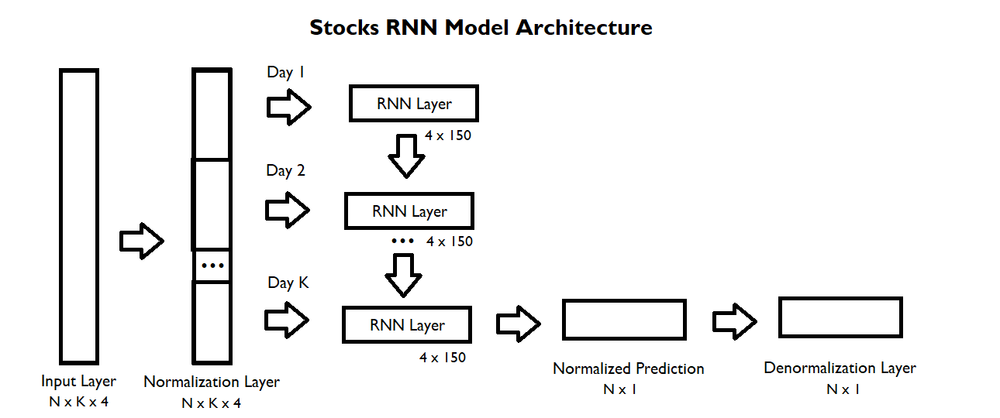
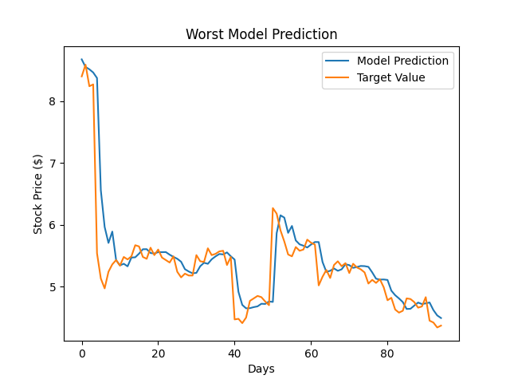
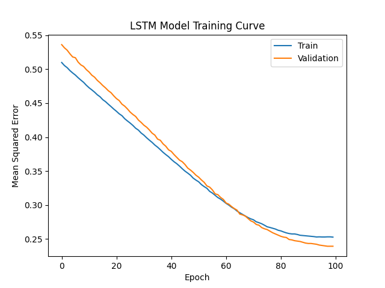

# Welcome to Stocks RNN

## Introduction

The purpose of this project is to create a recurrent neural network model to predict future stock market prices according to previous price ranges. The number of days the model is trained with will be treated as a hyperparameter, with the values tested for the hyperparameter ranging from 5 to 15. This model will be tested for accuracy based on its ability to predict stock values 1 day ahead, 2 days ahead, and 3 days ahead. For each of the options, this model will be tested on whether it correctly predicts a positive or negative change in stock price and how close it is to the total amount of increase or decrease in the stock price.

This recurrent neural network will be trained to both predict whether a stock price will increase or decrease, and separately predict by how much the stock will increase or decrease. As a result, this recurrent neural network will utilize both standard classification (increase or decrease) and standard regression. In addition to this, the model will also utilize LSTM (Long Short Term Memory) to remember certain previous trends to aid in the predictions of future stock prices.

## Model

### Figure

### Parameters

For the RNN stocks model there is one rnn layer with 4x150 parameters with 150 biases and one fully connected layer of size 150x1 with 1 bias. Hence there are 4x150 + 150 + 150x1 + 1 = 600 + 150 + 150 + 1 = 901 total parameters.

### Examples

Best Model Prediction with a mean squared error of approximately 0.12.

Worst Model Prediction of Mean Squared Error of approximately 0.65.

## Data

### Source

https://www.kaggle.com/datasets/borismarjanovic/price-volume-data-for-all-us-stocks-etfs

The dataset that will be utilized to train this model will be, "Huge Stock Market Dataset" by Boris Marjanovic under the CC0: Public Domain License. This dataset contains all US-based stocks and ETFs.

### Summary

For this project, we will only be using Stocks (not ETFs). This dataset contains 7195 different stock companies and their own stock price ranges per day in their own file.

Given a specific date and company, this dataset contains information on the open price of the day, the highest price of the day, the lowest price of the day, the closing price of the day, volume and OpenInt of that company's stocks for that date.

### Transformation

Of the 7195 different stock companies, there are 580 companies that contain less than 100 days of data. Hence they will be removed from the used dataset. As a result, there will be a total of 6615 companies, from each we will take the 100 most recent available days and utilize them as our dataset for this project.

The volume and OpenInt will be ignored for this dataset as they are irrelevant for the purpose of predicting future price changes.

### Split

The data was first randomized, then split such that 60% of the data was assigned as training data, 20% was assigned as validation data, and 20% was assigned as test data. This split was chosen arbitrarily, however the randomization was important to ensure each data section had both recent and old data points. If the data points were split based on time, trends found in recent or older stocks may not be recognized by the model depending on the time split. Similarly, if the data points were split based on company the model may not recognize techniques or patterns that another company used. As such, the data was simply split randomly rather than based on a particular attribute.

## Testing

### Training Curve

### Hyperparameter Tuning

### Quantitative Measures

### Quantitative and Qualitative Results

### Justification of Results

## Ethical Considerations

There are many ethical implications from being aware of this model's existence. An example of this is how it would affect middle-class people. Advertising this model as a flawless predictor of stocks may result in many individuals blindly trusting the predictions from this model and may result in one losing their entire life savings. In addition to this, the people who are aware of the model and its uses could be aware that a group of users may purchase or sell at a specific time based on the model's predictions and use that knowledge for their own personal gain.

This could also be utilized to manipulate middle-class people by influential individuals or company owners. Individuals with a strong influential potential may use these predictions to manipulate users into buying or selling at a particular time for personal gain. On the other hand, as a company owner knowing when people will sell or buy your company's share of the stock could be maliciously used to control when to decrease or increase your company's stakes.

## Authors

Most of the work for this project will be done collaboratively utilizing VSC's (visual studio code's) extension of live share which allows multiple users to collaborate and work on the same file at the same time. In addition to this, there will be open verbal communication via a voice call on Discord throughout this project. Training and testing models may be done utilizing Google Collab to make use of their GPUs. Weekly progress meetings will be conducted on Friday 3-4pm and Sunday 3-4pm.

### Division of Work

Importing and Preprocessing Data: Kesavar and Ryan

Base Recurrent Neural Network Model: Kesavar, Ryan and Carmelo

LSTM Recurrent Neural Network Model: Kesavar and Ryan

Training Function: Kesavar and Carmelo and Ryan

Overfit to Single Point: Kesavar and Carmelo

Testing RNNs and Displaying Results: Kesavar, Ryan and Carmelo
